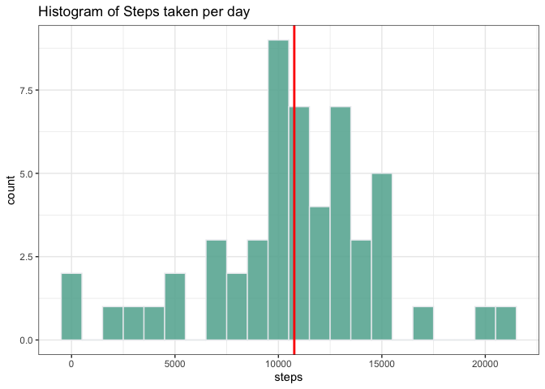
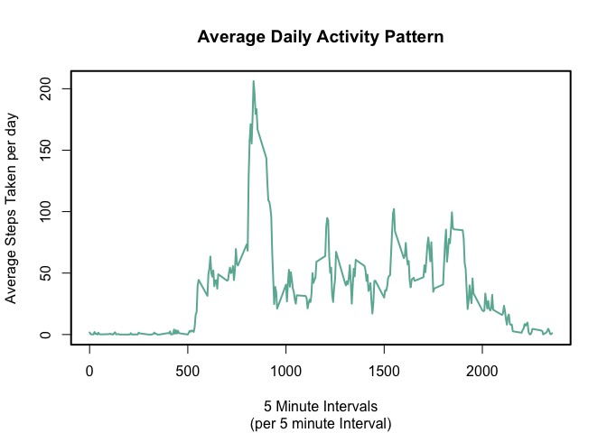
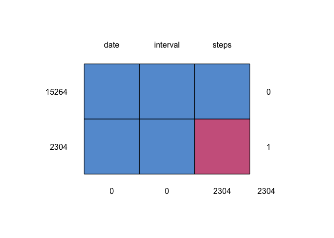
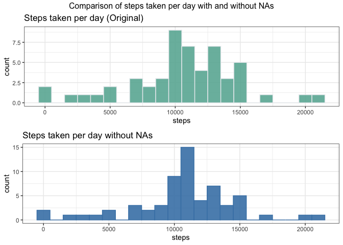
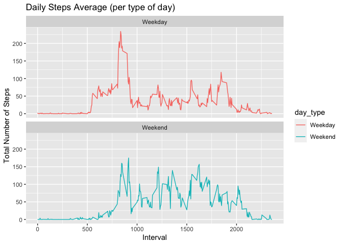

Document Generation Timestamp: Wed Apr 15 20:20:40 2020. 

## Instructions
It is now possible to collect a large amount of data about personal movement using activity monitoring devices such as a Fitbit, Nike Fuelband, or Jawbone Up. These type of devices are part of the “quantified self” movement – a group of enthusiasts who take measurements about themselves regularly to improve their health, to find patterns in their behavior, or because they are tech geeks. But these data remain under-utilized both because the raw data are hard to obtain and there is a lack of statistical methods and software for processing and interpreting the data.

This assignment makes use of data from a personal activity monitoring device. This device collects data at 5 minute intervals through out the day. The data consists of two months of data from an anonymous individual collected during the months of October and November, 2012 and include the number of steps taken in 5 minute intervals each day.

The data for this assignment can be downloaded from the course web site:

Dataset: [Activity Monitoring Data Set](https://d396qusza40orc.cloudfront.net/repdata%2Fdata%2Factivity.zip) [52K]

The variables included in this dataset are:

*steps:* Number of steps taking in a 5-minute interval (missing values are coded as NA)  
*date:* The date on which the measurement was taken in YYYY-MM-DD format  
*interval:* Identifier for the 5-minute interval in which measurement was taken  

The dataset is stored in a comma-separated-value (CSV) file and there are a total of 17,568 observations in this dataset.


### 1. Pre - Preocessing Steps
Load required libraries to the environment:

library(dplyr)
library(ggplot2)
library(data.table)


### 1.1 Load the data into a table and show a summary for the data.


```r
setwd("/Users/jromero/Documents/R/datasciencecoursera/data/RResearch_Project1")

if(!file.exists("activity.csv")){
  unzip('activity.zip')
}

data <- data.table(read.csv("activity.csv"))
str(data)
```

```
## Classes 'data.table' and 'data.frame':	17568 obs. of  3 variables:
##  $ steps   : int  NA NA NA NA NA NA NA NA NA NA ...
##  $ date    : Factor w/ 61 levels "2012-10-01","2012-10-02",..: 1 1 1 1 1 1 1 1 1 1 ...
##  $ interval: int  0 5 10 15 20 25 30 35 40 45 ...
##  - attr(*, ".internal.selfref")=<externalptr>
```

#### Question 1: Calculate the total number of steps taken per day

*Only first 15 rows shown*  


```r
q1 <- aggregate(steps ~ date, data = data, FUN=sum,  na.rm=TRUE)
kable(q1[1:15,1:2], caption = "Total Steps per Day", row.names = TRUE)
```


Table: Total Steps per Day

     date          steps
---  -----------  ------
1    2012-10-02      126
2    2012-10-03    11352
3    2012-10-04    12116
4    2012-10-05    13294
5    2012-10-06    15420
6    2012-10-07    11015
7    2012-10-09    12811
8    2012-10-10     9900
9    2012-10-11    10304
10   2012-10-12    17382
11   2012-10-13    12426
12   2012-10-14    15098
13   2012-10-15    10139
14   2012-10-16    15084
15   2012-10-17    13452


#### Question2: Histogram of the total number of steps taken each day

The figure shows the total number of steps taken each day, NA values were removed from the data.
The red line indicates the mean number of steps taken per day by the subject


```r
g <- ggplot(q1, aes(x=steps)) + 
     geom_histogram(color="#e9ecef", fill="#69b3a2", alpha=0.9, binwidth = 1000) +
     ggtitle("Histogram of Steps taken per day") +
     geom_vline(aes(xintercept=mean(steps)),color="red",size=1) +
     theme_bw() 
print(g)
```

<!-- -->

#### Question 3: Calculate and report the mean and median total number of steps taken per day.

1. Mean Calculation


```r
q3_mean <- mean(q1$steps)
print(q3_mean)
```

```
## [1] 10766.19
```

2. Median Calculation


```r
q3_median <- median(q1$steps)
print(q3_median)
```

```
## [1] 10765
```
3. Validated the results for mean and median via the summary function.


```r
summary(q1)
```

```
##          date        steps      
##  2012-10-02: 1   Min.   :   41  
##  2012-10-03: 1   1st Qu.: 8841  
##  2012-10-04: 1   Median :10765  
##  2012-10-05: 1   Mean   :10766  
##  2012-10-06: 1   3rd Qu.:13294  
##  2012-10-07: 1   Max.   :21194  
##  (Other)   :47
```


#### Question 4: Make a time series plot (i.e. type = "l") of the 5-minute interval (x-axis) and the average number of steps taken, averaged across all days (y-axis)


```r
q4 <- aggregate(steps ~ interval, data = data, FUN=mean,  na.rm=TRUE)
kable(q4[1:10,], caption = "Average Daily Activity Pattern ", row.names = TRUE)
```


Table: Average Daily Activity Pattern 

      interval       steps
---  ---------  ----------
1            0   1.7169811
2            5   0.3396226
3           10   0.1320755
4           15   0.1509434
5           20   0.0754717
6           25   2.0943396
7           30   0.5283019
8           35   0.8679245
9           40   0.0000000
10          45   1.4716981

```r
par(lwd=2)
plot(x=q4$interval,y=q4$steps,
     type="l",
     col="#69b3a2",
     ylab="Average Steps Taken per day",
     xlab="5 Minute Intervals",
     main="Average Daily Activity Pattern",
     sub="(per 5 minute Interval)"
     
     )
```

<!-- -->


###


#### Question 5: Which 5-minute interval, on average across all the days in the dataset, contains the maximum number of steps?


```r
q5 <- q4$interval[which.max(q4$steps)]
q5.1 <- subset(q4,interval==835)
```


The interval 835  contains the maximum number of steps (206)

### Imputing Missing Values

#

#### Question 6.1: Calculate and report the total number of missing values in the dataset (i.e. the total number of rows with NAs)


```r
data_nas<- sum(is.na (data$steps))
data_nas
```

```
## [1] 2304
```

The total number of rows with NAs for the variable "steps" is 2304.


#### Question 6.2 Devise a strategy for filling in all of the missing values in the dataset. The strategy does not need to be sophisticated.
#

```r
nas_pct <- nrow(data[!complete.cases(data), ])/nrow(data)*100 # % of rows with NAs
```

The percentage of missing data, prior to imputing the mean is 13%.  


```r
data <- data.table(read.csv("activity.csv")) # Re-read data into data variable

library(mice)
md.pattern(data)
```

<!-- -->

```
##       date interval steps     
## 15264    1        1     1    0
## 2304     1        1     0    1
##          0        0  2304 2304
```


#### Question 6.3 Create a new dataset that is equal to the original dataset but with the missing data filled in.  
#  
#  

```r
data_complete_cases <- data
data_complete_cases$steps[is.na(data_complete_cases$steps)] = mean(data_complete_cases$steps, na.rm=TRUE) # replace NAs with mean value
data_nas_complete <- sum(is.na (data_complete_cases$steps)) ## Verify our work, should be equal to 0
data_nas_complete
```

```
## [1] 0
```

#  
After imputing the steps variable from the original data with the mean of the same variable, the number of observations with NAs is **0**.

The new data set is now "data_complete_cases"


```r
str(data_complete_cases)
```

```
## Classes 'data.table' and 'data.frame':	17568 obs. of  3 variables:
##  $ steps   : num  37.4 37.4 37.4 37.4 37.4 ...
##  $ date    : Factor w/ 61 levels "2012-10-01","2012-10-02",..: 1 1 1 1 1 1 1 1 1 1 ...
##  $ interval: int  0 5 10 15 20 25 30 35 40 45 ...
##  - attr(*, ".internal.selfref")=<externalptr>
```

#  

#### Question 7: Make a histogram of the total number of steps taken each day and Calculate and report the mean and median total number of steps taken per day. Do these values differ from the estimates from the first part of the assignment? What is the impact of imputing missing data on the estimates of the total daily number of steps?
#  


```r
q1 <- aggregate(steps ~ date, data = data, FUN=sum,  na.rm=TRUE) #Original total steps per day
kable(q1[1:10,1:2], caption = "Total Steps per Day", row.names = TRUE)
```


Table: Total Steps per Day

     date          steps
---  -----------  ------
1    2012-10-02      126
2    2012-10-03    11352
3    2012-10-04    12116
4    2012-10-05    13294
5    2012-10-06    15420
6    2012-10-07    11015
7    2012-10-09    12811
8    2012-10-10     9900
9    2012-10-11    10304
10   2012-10-12    17382

```r
q7 <- aggregate(steps ~ date, data = data_complete_cases, FUN=sum,  na.rm=TRUE) # Total Steps per day w/o NAs
kable(q7[1:10,1:2], caption = "Total Steps per Day Without NAs", row.names = TRUE)
```


Table: Total Steps per Day Without NAs

     date             steps
---  -----------  ---------
1    2012-10-01    10766.19
2    2012-10-02      126.00
3    2012-10-03    11352.00
4    2012-10-04    12116.00
5    2012-10-05    13294.00
6    2012-10-06    15420.00
7    2012-10-07    11015.00
8    2012-10-08    10766.19
9    2012-10-09    12811.00
10   2012-10-10     9900.00
#  


```r
g <- ggplot(q1, aes(x=steps)) + 
     geom_histogram(color="#e9ecef", fill="#69b3a2", alpha=0.9, binwidth = 1000) +
     ggtitle("Steps taken per day (Original)") +
     theme_bw() 

g1 <- ggplot(q7, aes(x=steps)) + 
     geom_histogram(color="steelblue", fill="steelblue", alpha=0.9, binwidth = 1000) +
     ggtitle("Steps taken per day without NAs") +
     theme_bw() 

grid.arrange(g,g1,nrow=2, ncol=1, top="Comparison of steps taken per day with and without NAs")
```

<!-- -->

#  

```r
summary(q1)
```

```
##          date        steps      
##  2012-10-02: 1   Min.   :   41  
##  2012-10-03: 1   1st Qu.: 8841  
##  2012-10-04: 1   Median :10765  
##  2012-10-05: 1   Mean   :10766  
##  2012-10-06: 1   3rd Qu.:13294  
##  2012-10-07: 1   Max.   :21194  
##  (Other)   :47
```
#  

```r
summary(q7)
```

```
##          date        steps      
##  2012-10-01: 1   Min.   :   41  
##  2012-10-02: 1   1st Qu.: 9819  
##  2012-10-03: 1   Median :10766  
##  2012-10-04: 1   Mean   :10766  
##  2012-10-05: 1   3rd Qu.:12811  
##  2012-10-06: 1   Max.   :21194  
##  (Other)   :55
```

#  
Please note how even though the median and mean ara almost identical, the distribution of quantiles shown is different at the quartile 3   
  
#    
#### Question 8: Are there differences in activity patterns between weekdays and weekends?

#  

#### Question 8.1: Create a new factor variable in the dataset with two levels – “weekday” and “weekend” indicating whether a given date is a weekday or weekend day.


```r
q8 <- data.table(read.csv("activity.csv")) # Re-read data into data variable
q8$date <- as.Date(as.character(q8$date))
q8<- q8%>%
        mutate(day_type= ifelse(weekdays(q8$date)=="Saturday" | weekdays(q8$date)=="Sunday", "Weekend", "Weekday"))
table(q8$day_type)
```

```
## 
## Weekday Weekend 
##   12960    4608
```

#  

#### Question 8.2 Make a panel plot containing a time series plot (i.e. type = “l”) of the 5-minute interval (x-axis) and the average number of steps taken, averaged across all weekday days or weekend days (y-axis).

#  


```r
q8.2 <- aggregate(steps ~ interval + day_type ,data=q8, FUN = mean, na.rm = TRUE)
ggplot(q8.2, aes(x =interval , y=steps, color=day_type)) +
       geom_line() +
       labs(title = "Daily Steps Average (per type of day)", x = "Interval", y = "Total Number of Steps") +
       facet_wrap(~ day_type, ncol = 1, nrow=2)
```

<!-- -->

